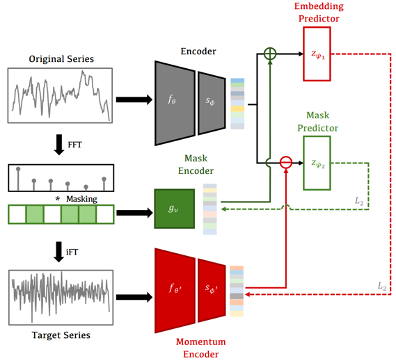

# Frequency-Masked Embedding Inference

<p align="center">
<a href="https://github.com/USTBInnovationPark/Frequency-masked-Embedding-Inference/blob/main/Appendix.pdf">
    
</a>
<a href="">
    
</a>
</p>

This repository contains the official code for the AAAI-25 paper:

*Frequency-masked Embedding Inference: A Non-Contrastive Approach for Time Series Representation Learning*

The proceeding version is being processed and will be released soon. The final reference version will be added here once available.

FEI is a time series self-supervised pretraining framework based on the Joint-Embedding Predictive Architecture (JEPA) concept, without any explicit contrastive structure.


# Repository Structure
```
- config/                All model and training configurations
- datasets_clsa/         Classification dataset construction
- datasets_reg/          Regression dataset construction
- models/                Contains Baseline implementations and FEI architecture code
- train/                 Base class for all training code, as well as saving training logs and results
- util/                  All utility methods, including the frequency masking code for FEI
- experiments.py         Entry point for running training and testing
```

# Requirements
```
numpy~=1.24.3
torch~=2.0.1
scikit-learn~=1.3.0
matplotlib~=3.7.2
tsaug~=0.2.1
pandas~=2.0.3
```

# Preparing Datasets
## Classification Datasets

The pre-train dataset SleepEEG and Classification datasets could be downloaded from:

<p align="center">
<a href="https://figshare.com/ndownloader/articles/19930178/versions/1">
    
</a>
<a href="https://figshare.com/ndownloader/articles/19930247/versions/1">
    
</a>
<a href="https://figshare.com/ndownloader/articles/19930226/versions/1">
    
</a>
<a href="https://figshare.com/ndownloader/articles/19930250/versions/1">
    
</a>
<a href="https://figshare.com/ndownloader/articles/19930199/versions/2">
    
</a>
<a href="https://figshare.com/ndownloader/articles/19930244/versions/1">
    
</a>
<a href="https://www.cs.ucr.edu/~eamonn/time_series_data_2018/">
    
</a>
</p>

More dataset details can be found in the [TF-C repository](https://github.com/mims-harvard/TFC-pretraining) and our Appendix.

All classification datasets, **except for the 128 UCR dataset**, should follow the structure of train.pt/test.pt/val.pt, where each .pt file contains a dictionary with keys "samples" and "labels," corresponding to the sample and label data. See the TF-C dataset structure for details.

After downloading, place the datasets in the datasets_clsa folder. For example, the correct directory structure for the Gesture dataset should be as follows:

```
- datasets_clsa
  - Gesture
    - train.pt
    - test.pt
    - val.pt
```

For the 128 UCR dataset, the directory structure should be as follows:
```
- datasets_clsa
  - UCR
    - ACSF1
      - ACSF1_TEST.tsv
      - ACSF1_TRAIN.tsv
      - README.md
    - Adiac
    ...
```

## Regression Datasets

All datasets of Regression task could be downloaded from:

<p align="center">
<a href="https://github.com/schwxd/LSTM-Keras-CMAPSS/tree/master/C-MAPSS-Data">
    
</a>
<a href="https://biaowang.tech/xjtu-sy-bearing-datasets/">
    
</a>
</p>

No additional processing is needed for regression datasets. Simply place them in the datasets_reg folder:

```
- datasets_reg
  - CMAPSS
    - FD001
    - FD002
    - FD003
    - FD004
```

# Quick Start
To quickly start pre-training, use the following command:
> python ./experiment.py --task_type=p --method=FEI

After pre-training, you can find the corresponding logs and results in the `train/model_result/` directory. To validate the pre-trained model, use the following command:
> python ./experiment.py --model=./train/model_result/your_model_path --task_type=l --task=c --dataset=FDB --method=FEI

You can adjust the task type, dataset, and other parameters by modifying the arguments like --task_type and --dataset. For more help with run parameters, use:
> python ./experiment.py -h

Further code details will be described soon.
